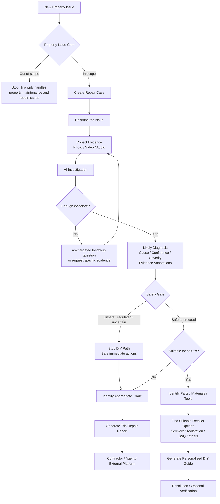

# Tria Home

> **AI-powered property repair triage — from “something is wrong” to knowing what to do next.**

Tria Home is a focused AI assistant for diagnosing and resolving **home and property maintenance problems**.

When something breaks, leaks, comes loose, makes an unusual noise, stops working, or otherwise needs attention, the user should not need to know the technical name of the fault or which trade to call. They show Tria the problem using a description, photo, video, or audio recording. Tria investigates the issue, asks for better evidence when needed, explains the likely fault, highlights relevant areas in the submitted evidence, applies safety guardrails, and helps determine the appropriate next step.

The goal is to automate as much of the journey from **problem discovered → problem understood → appropriate resolution** as is safely possible. Human intervention should be required primarily when the physical repair itself requires a professional, or where safety, uncertainty, regulation, or policy requires escalation.

## Working motto

**See. Snap. Sort.**

This is a working product motto rather than a final marketing decision:

- **See** — notice a problem in the property.
- **Snap** — show Tria what is happening using photos, video, audio, and a short description.
- **Sort** — understand the problem and move towards the appropriate resolution: safe self-fix, parts/tools, or professional help.

## Product scope

Tria Home is deliberately **not a general-purpose AI assistant**.

It operates within one domain:

> **Diagnosing, investigating, maintaining and repairing problems associated with a home/property, its fixtures, fittings, systems and relevant household appliances.**

Examples of in-scope issues include:

- leaking pipes, taps and waste fittings;
- toilets and drainage problems;
- doors, handles, hinges and locks;
- windows and seals;
- heating and hot-water problems;
- selected appliance faults;
- electrical faults and warning signs, subject to strict safety controls;
- damp, mould and water ingress;
- walls, ceilings, flooring and fixtures;
- other property maintenance and repair issues.

Out-of-domain requests should be rejected rather than passed through to the underlying general-purpose AI. A photograph of an injury, a cooking request, general knowledge question, CV request, coding problem, or other unrelated task is not a Tria case.

## Who Tria is for

The core diagnostic experience should work for anyone responsible for, living in, or reporting a problem with a property.

### Homeowners

A homeowner discovers a problem but does not know what it is, whether it is dangerous, whether they can fix it themselves, what part is required, or which professional they need.

### Tenants

A tenant can clearly document a maintenance problem and, where appropriate, receive safe guidance. In future managed-property workflows, the resulting Tria Repair Report can be provided directly to the landlord, letting agent, property manager, or contractor.

### Landlords

A landlord can investigate problems remotely, reduce unnecessary diagnostic call-outs, and receive better evidence before deciding what action is required.

### Letting and property-management organisations

The same Tria diagnostic engine can eventually sit behind an automated maintenance-reporting workflow. Tenants may report issues through web, app, or AI voice; Tria collects evidence and triages the case before human intervention is required.

### Contractors

Contractors are primarily a downstream user rather than the initial customer experience. A professional can receive a structured repair brief containing the evidence, likely fault, annotations, safety information, likely parts and other information gathered by Tria before attending the property.

## Core principles

### 1. Investigate before guessing

Tria should not produce a confident diagnosis simply because one image was submitted. If the evidence is insufficient, it asks for the next useful piece of evidence.

Examples:

- “Take a wider photo showing the pipework under the sink.”
- “Now take a close-up of the highlighted connection.”
- “Record a short video while the washing machine drains, but only if it is safe to reproduce the problem.”
- “Record the sound the appliance is making.”

The investigation therefore operates as a loop rather than a single AI request.

### 2. Safety before repair

Safety is a system-level constraint, not a disclaimer added at the end.

Potential gas, electrical, structural, fire, flooding and other high-risk conditions must be capable of interrupting the normal investigation immediately. Tria must not provide unsafe DIY instructions simply because an AI model believes it recognises the fault.

Where appropriate, Tria should provide conservative immediate safety instructions and route the case towards qualified professional help.

### 3. Explain visually

Where possible, Tria should annotate the user's original evidence to identify the component or area being discussed — for example, the suspected leaking joint, damaged seal, loose fixing or other relevant feature.

Annotations should support the diagnosis rather than pretend to prove it.

### 4. Keep uncertainty visible

The system should distinguish between what is observed, what is inferred, and what remains uncertain. Confidence and evidence quality should influence whether Tria asks another question, offers DIY guidance, or escalates the case.

### 5. Resolution, not conversation

The objective is not to create an open-ended chatbot. The objective is to move a property problem towards an appropriate outcome.

For a low-risk issue, that may mean identifying the required parts/tools and providing a safe repair guide. For another issue, it may mean identifying the correct trade and producing a contractor-ready repair report.

## Initial product flow

The first development phase focuses only on the core diagnostic and resolution engine.

Safety checks may occur earlier than the formal `Safety Gate`. If the description or evidence indicates an immediate hazard, the normal diagnostic flow can be interrupted at any point.

## Initial channels

The architecture should eventually allow a Repair Case to originate from multiple channels:

- responsive web application;
- mobile application;
- AI telephone/voice intake;
- secure links sent to tenants or other reporters;
- future integrations with property-management systems.

All channels should feed the same underlying **Repair Case** and diagnostic engine.

The first implementation should be a responsive web application. Native mobile applications and AI telephone intake can be added after the core investigation flow is proven.

## The Tria Repair Case

A Repair Case is the central object in the system. It should eventually contain information such as:

- reporter and property context where available;
- initial problem description;
- photos, videos and audio;
- AI observations;
- questions asked and answers received;
- requested additional evidence;
- likely fault and possible causes;
- confidence and uncertainty;
- annotations;
- safety classification and safety actions;
- DIY/professional decision;
- likely parts, materials and tools;
- retailer options;
- repair instructions where appropriate;
- required trade where professional help is needed;
- final Tria Repair Report;
- eventual resolution/outcome.

## V0.1 goal

The first prototype should prove one complete vertical slice rather than attempt to build the whole property-management ecosystem.

A successful V0.1 should allow a user to:

1. start a property repair case;
2. describe the problem;
3. take or upload a photo;
4. have Tria determine whether the request is within its property-repair scope;
5. analyse the evidence;
6. request another photo or answer when the available evidence is insufficient;
7. provide a likely diagnosis with clearly represented uncertainty;
8. annotate relevant evidence;
9. apply safety controls before repair advice is released;
10. decide between a safe self-fix path and professional escalation;
11. for suitable self-fixes, identify likely parts/tools and retailer options and provide a personalised guide;
12. otherwise, identify the appropriate trade and generate a structured repair report.

A leaking or loose under-sink waste connection is a useful first end-to-end test case because it exercises visual investigation, follow-up evidence, component identification, parts identification and low-risk DIY guidance without making high-risk electrical or gas diagnosis the first prototype target.

## Not in V0.1

To keep the initial build focused, the following are intentionally outside the first implementation:

- proprietary contractor marketplace;
- contractor reviews or vetting;
- contractor scheduling;
- payments;
- automated landlord approval rules;
- full letting-agent/property-manager dashboard;
- large property portfolio management;
- native iOS/Android applications;
- AI telephone support;
- deep integrations with property-management platforms;
- preventive maintenance programmes;
- general-purpose DIY or home-improvement planning unrelated to a fault.

These may become later layers around the core Tria diagnostic engine.

## Longer-term direction

The longer-term opportunity is to reduce unnecessary human intervention throughout property maintenance.

For example, a managed-property tenant could eventually call a Tria telephone number, verify their property, explain the problem to an AI voice assistant, receive a secure evidence-collection link, complete the investigation, and have the case safely resolved or escalated without a letting agent manually triaging the initial report.

That future workflow still depends on the same capability being built first:

> **Understand the property problem, gather the right evidence, protect the user, and determine the right next action.**

## Development philosophy

The early product should optimise for **diagnostic quality, safety, evidence gathering and useful outcomes**, not feature count.

The core question for each build iteration is:

> Can Tria take a real property problem that a non-expert does not understand and safely move it closer to resolution with less unnecessary human intervention?

If the answer becomes consistently yes, dashboards, integrations, voice channels, retailer integrations and professional workflows can be built around that engine.
